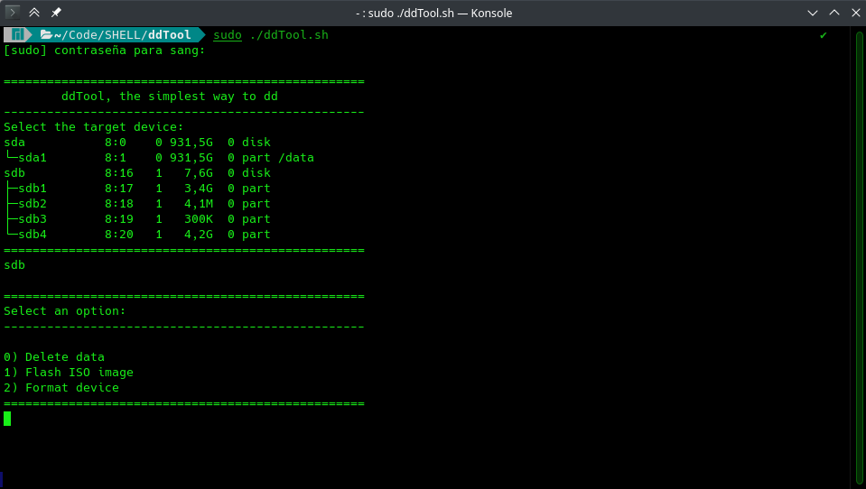
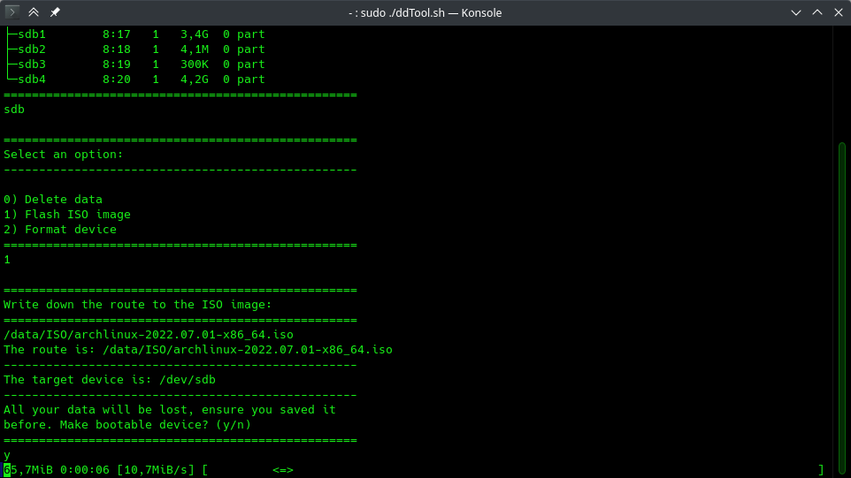
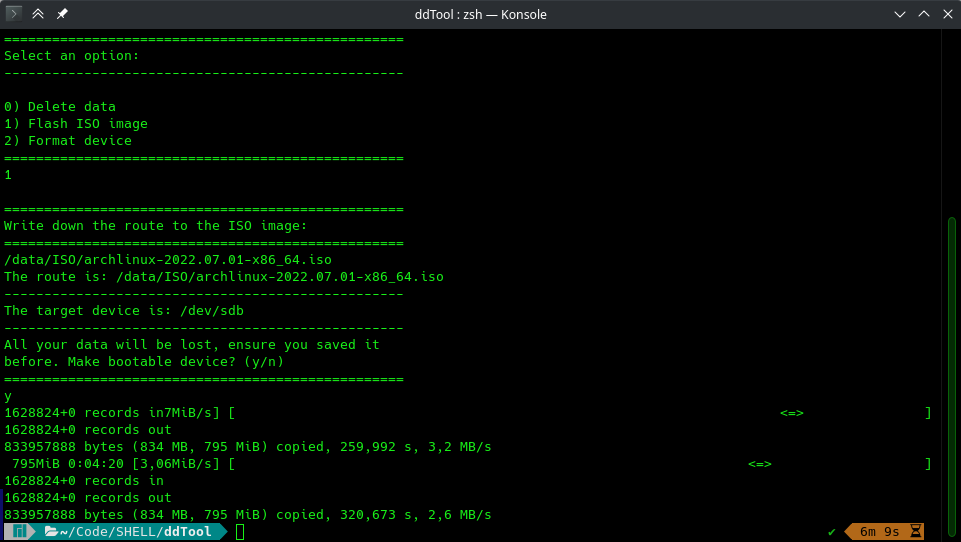
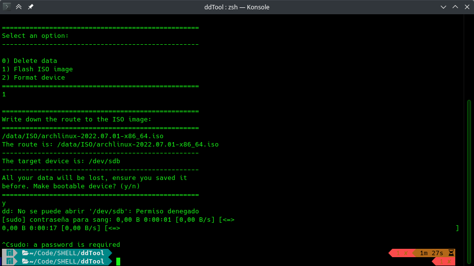

# ddTool

----

This is a simple shell script (bash) for a basic usage of the `dd` command.
It can be use for flashing OS images in a USB device, as well as for deleting
data or making filesystems.

----

**Advise:** Do not mount the target device, just plug it in your pc and follow
the next instructions.

It is **Necessary** that you run the program as SUDO, otherway it is going to
return an error.

----

### 1) Running the program.

```bash
sudo ./ddtool.sh
```

First, you have to choose the target device, it will be shown on the list, in
my case it's `sdb`, but you can choose between devices and partitions.

A device: `sdx`

A partition: `sdxN`

Where `x` is the device identifier (a, b, c, etc.), and `N` is the partition
number.



----

### 2) Choosing an option.

Next, choose one of the displayed options. Here's an example with option 2.
For the route, just go where the file is located, right click in your selection
and "copy location" or, single click over the file and `Ctrl + alt + c`.
Then paste the route with `Ctrl + shift + v`.

Check that everything is OK and continue with `y`, then `Return`.

You'll see the progress bar at the bottom, meaning that the work is in
progress. It'll take some minutes.



----

### 3) Successful operation.



----

### 4) Error displayed when not running as SUDO.

Just exit using `Ctrl + c` and run the tool again as SUDO.



----

Santino Fuentes, 2022.
